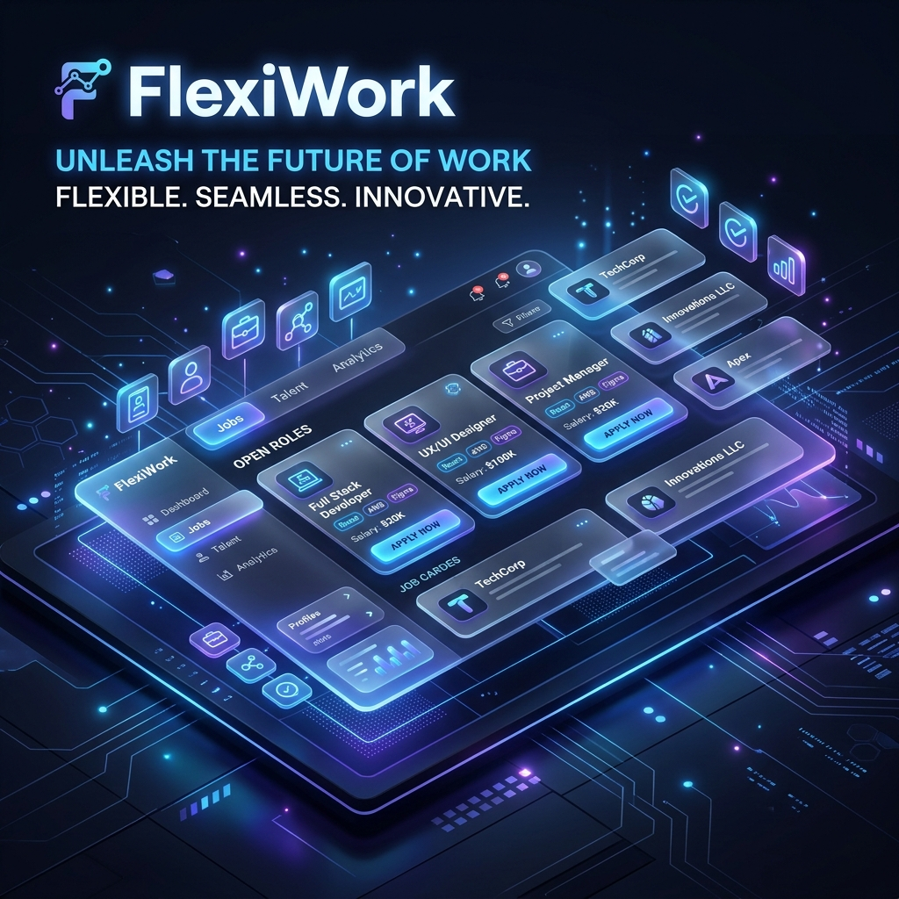

<div align="center">
  
  <br />
  <br />
  
  [](https://nextjs.org)
  [](https://mongodb.com)
  [](https://tailwindcss.com)
  [](https://next-auth.js.org)

  <p align="center">
    <b>Unleash the Future of Work: Flexible. Seamless. Innovative.</b>
    <br />
    <i>The hyper-local gig economy portal for Tier-2/3 cities like Dhanbad.</i>
  </p>
</div>

---

## 🚀 Overview

**FlexiWork** is a production-ready, full-stack gig portal designed to connect local talent with immediate opportunities. Built on **Next.js 16**, it provides a role-based experience for both Job Seekers and Employers, featuring a unique trust-score system to ensure reliability in every transaction.

### 🌟 Key Features

- **🛡️ Dual-Role Architecture**: Instantly switch between "Job Seeker" and "Job Poster" modes within a single account.
- **📍 Hyper-Local Discovery**: Focused job feed for Dhanbad, Jharkhand, with realistic geospatial listing support.
- **🍞 Premium UX**: Integrated `react-hot-toast` for fluid, non-blocking feedback and high-fidelity skeletons for zero-flicker loading.
- **🤝 Trust & Verified Reputation**: A robust penalty system for "No-Shows" that maintains platform integrity and candidate quality.
- **🌓 Modern Aesthetics**: A stunning glassmorphism-inspired UI designed for both impact and clarity.

---

## 🛠️ Tech Stack

- **Framework**: [Next.js 16 (App Router)](https://nextjs.org)
- **Database**: [MongoDB](https://mongodb.com) with [Mongoose](https://mongoosejs.com)
- **Authentication**: [NextAuth.js](https://next-auth.js.org) (Google OAuth)
- **Styling**: [Tailwind CSS v4](https://tailwindcss.com)
- **Validation**: [Zod](https://zod.dev)
- **Notifications**: [React Hot Toast](https://react-hot-toast.com)
- **Icons**: [React Icons](https://react-icons.github.io/react-icons/)

---

## 🚦 Getting Started

### Prerequisites

- Node.js 20+
- A MongoDB Connection String
- Google Cloud Console credentials (for OAuth)

### Installation

1. **Clone the repository:**
   ```bash
   git clone https://github.com/amit2003-cse/FlexiWork.git
   cd FlexiWork
   ```

2. **Install dependencies:**
   ```bash
   npm install
   ```

3. **Configure Environment Variables:**
   Create a `.env.local` file with:
   ```env
   MONGODB_URI=your_mongodb_uri
   GOOGLE_CLIENT_ID=your_id
   GOOGLE_CLIENT_SECRET=your_secret
   NEXTAUTH_SECRET=your_nextauth_secret
   NEXTAUTH_URL=http://localhost:3000
   ```

4. **Seed Realistic Local Data:**
   ```bash
   node scripts/seed.mjs
   ```

5. **Run in Development Mode:**
   ```bash
   npm run dev
   ```

---

## 📸 Screenshots & Highlights

| **Dashboard (Employer Mode)** | **Job Feed (Seeker Mode)** |
|:---:|:---:|
| Management tools with applicant tracking | Seamless, categorized local job discovery |

---

## 🤝 Contributing

Contributions are what make the open-source community such an amazing place to learn, inspire, and create. Any contributions you make are **greatly appreciated**.

1. Fork the Project
2. Create your Feature Branch (`git checkout -b feature/AmazingFeature`)
3. Commit your Changes (`git commit -m 'Add some AmazingFeature'`)
4. Push to the Branch (`git push origin feature/AmazingFeature`)
5. Open a Pull Request

---

<div align="center">
  <p>Built with ❤️ for Dhanbad & the wider FlexiWork community.</p>
</div>
